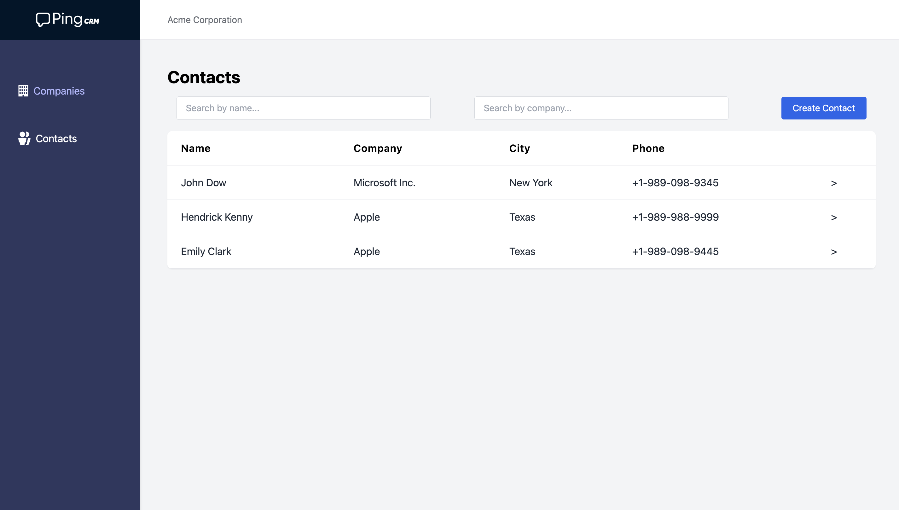
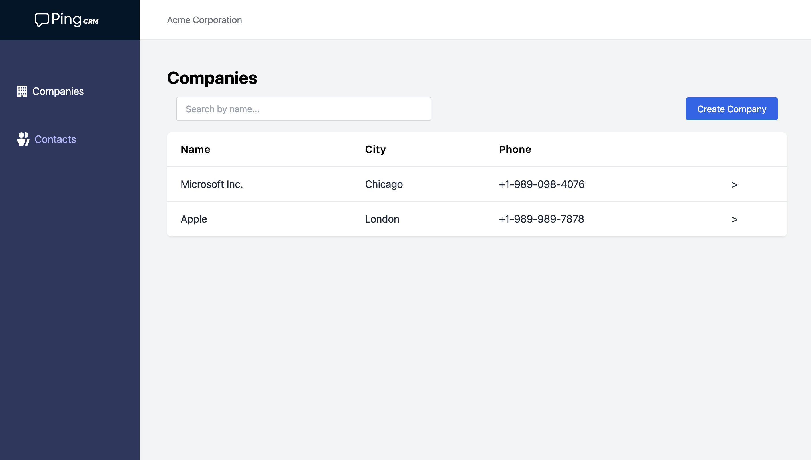
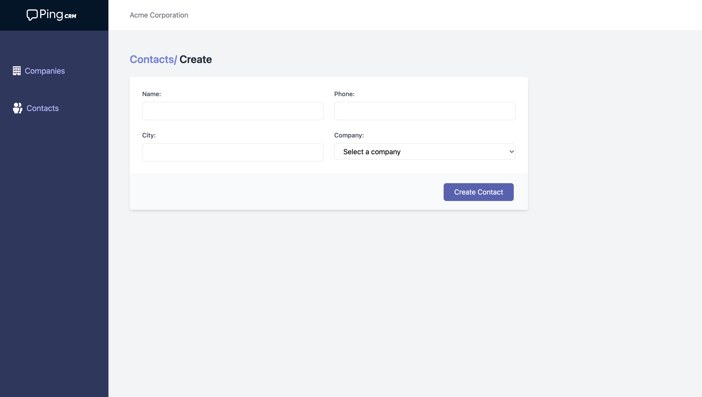

# PingCRM - React + FastAPI

A modern remake of the PingCRM project using **React** for the frontend and **FastAPI** for the backend.

This app supports full **Contact Management** and **Company Management**, integrated with **Supabase PostgreSQL** as the database. It features a clean dashboard UI, searching, filtering, and CRUD functionality.

---

## 🚀 Deployment

- 🔗 **Frontend (Vercel):** [https://pingcrm-git-main-sufyans-projects-aeb22075.vercel.app](https://pingcrm-git-main-sufyans-projects-aeb22075.vercel.app)
- 🔗 **Backend (Render):** [https://pingcrm-obbi.onrender.com](https://pingcrm-obbi.onrender.com)

---

## 🖥️ Running the Project Locally

### 📦 Backend (FastAPI)

```bash
1. cd backend
2. Install Python (if not already installed)
3. Create virtual environment:
   - macOS/Linux: python3 -m venv .venv
   - Windows: python -m venv .venv
4. Activate virtual environment:
   - macOS/Linux: source .venv/bin/activate
   - Windows: .venv\Scripts\activate
5. Install dependencies:
   pip install -r requirements.txt
6. Create a `.env` file from the example:
   mv .env.example .env
   # Then set your DATABASE_URL to your Supabase PostgreSQL connection string
7. Run the FastAPI server:
   uvicorn app.main:app --reload
```

## 💻 Frontend (React)

```bash
1. cd frontend
2. Create a `.env` file from the example:
   mv .env.example .env
3. Update the environment variable:
   REACT_APP_BACKEND_URL=https://pingcrm-obbi.onrender.com
   # Or replace with your own backend deployment URL
4. Install frontend dependencies:
   npm install
5. Start the development server:
   npm start
```

## 🧠 Database Details

This project uses **Supabase PostgreSQL** as the backend database.

- Connected to the backend via **SQLAlchemy**
- Used `create_engine()` with the Supabase connection string
- Connection string stored securely in the `.env` file as `DATABASE_URL`
- Tables:
  - `contacts`: Stores name, phone, city, and associated company
  - `companies`: Stores names, phone, city, email, address, province, country and postal_code

---

## ✅ Features Completed

### 🧑‍💼 Contact Management

- List contacts
- Create new contacts
- Edit and update existing contacts
- Delete contacts
- Each contact has:
  - `name`
  - `phone`
  - `city`
  - `company` (foreign key)

### 🏢 Company Management

- List all companies
- Create, update, delete companies
- Associate companies with multiple contacts

### 🔍 Search & Filter

- Search contacts by name
- Filter contacts by associated company

---

## ⏳ Time Invested

- **Development Time:** ~6 hours
- **Deployment Time:** ~45 minutes

---

## 🛠️ Tools & Technologies

- **Frontend:** React, TypeScript, Tailwind CSS, Axios
- **Backend:** FastAPI, Pydantic, SQLAlchemy, Uvicorn
- **Database:** Supabase PostgreSQL
- **Deployment:** Render (backend), Vercel (frontend)
- **Other:** React Router, React Hot Toast for notifications

---

## 🤖 AI Tools Used

For this project, I used the following AI tools to accelerate development and improve efficiency:

- **ChatGPT (by OpenAI):**  
  Assisted in:
  - Writing optimized backend and frontend code
  - Structuring API services using Axios
  - Creating README.md documentation
  - Debugging and improving logic
  - Implementing debounced search and modal-based confirmations

---

## 🖼️ Screenshots

> You can add actual screenshots below by uploading them or using markdown image syntax.

### 📋 Contact Listing Page



### 🏢 Company Management Page



### ➕ Add Contact Modal



---

## 🙏 Thanks

Big thanks to:

- **OpenAI** for ChatGPT, which made development faster and more organized
- **Supabase** for providing an easy-to-use and scalable PostgreSQL hosting solution
- **Render** and **Vercel** for smooth deployment
- Everyone who inspired and contributed to the original PingCRM project

---

> Made with ❤️ using React, FastAPI, and a lot of curiosity.
